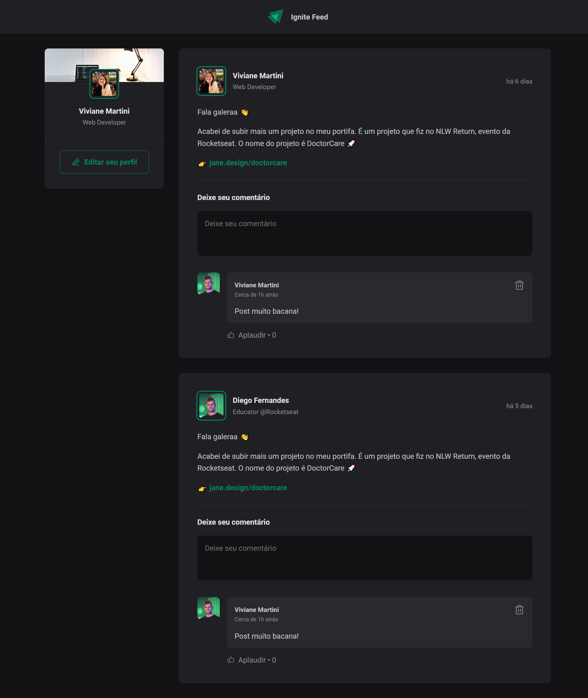

<div align="center">
  
</div>

###

<h1 align="center">Ignite Feed<br>

<br>
<h3 align="left">What I learned?</h3>

- React Fundamentals
- Build a React project
- Components
- Properties
- useState
- Key={}
- Closures

<h3 align="left">Note</h3>

The project was initially built using only react and css modules, later typescript was included. You can check the first version of commits [here](https://github.com/vivianemartini/ignite-feed).

- is possible to edit the user

<h3 align="left">Tecnologies and tools</h3>

<div >
- React <br>
- Typescript <br>
- JS <br>
- HTML <br>
- CSS Modules <br>
- Phosphor icons <br>
- Date-fns <br>
</div>


<br>
<h3>Preview</h3>


###

## Run locally

Clone the project and access the folder.

```bash
$ git clone
$ cd (folder)
```

Follow the steps below:

```bash
# Install the dependencies
$ yarn or npm i
# Start the project
$ yarn dev or npm run dev
```

The app will be available for access on your browser at http://localhost:3000


## 📝 License

This project is licensed under the MIT License. See the [LICENSE](LICENSE.md) file for details.